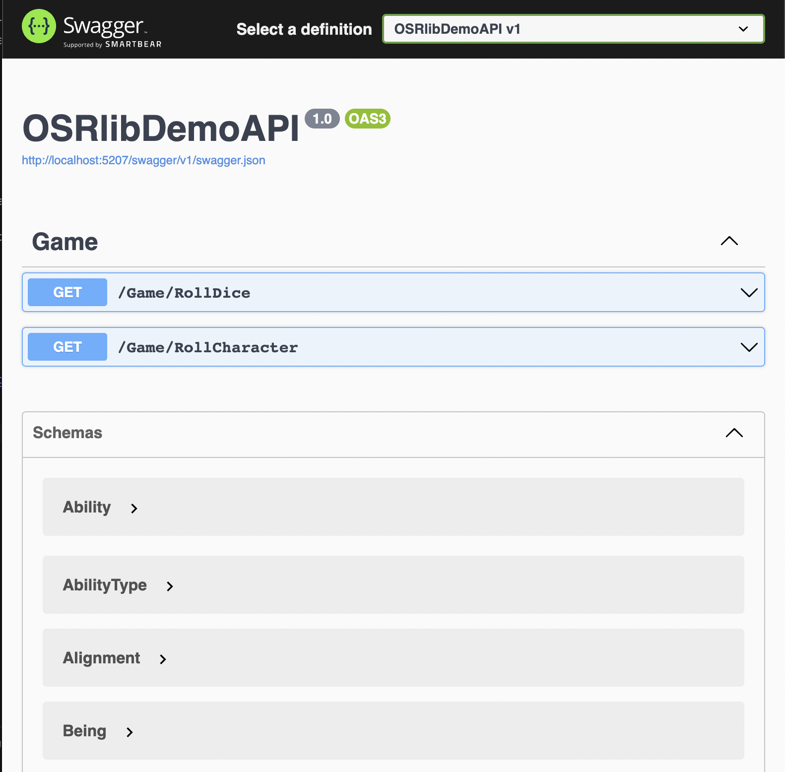

# Demo ASP.NET web API for OSRlib.NET

This ASP.NET web API shows a sample implementation of a REST-style web API whose endpoints surface [OSRlib.NET](https://github.com/mmacy/osrlib-dotnet) functionality to remote client applications.

Like the [OSRlib.NET package](https://www.nuget.org/packages/osrlib.Core) itself, this sample application is in the early stages of development.

## Prerequisites

- .NET SDK 7.0+

## Getting started

To build and start the web API:

1. Clone this repository by using `git clone`.
1. Move into the project's `src` directory use the .NET CLI to start the API. If you're asked whether to restore project dependencies, say **Yes**.

    ```bash
    cd osrlib-demo-api/src
    dotnet run
    ```

    You should see output similar to the following:

    ```bash
    Building...
    info: Microsoft.Hosting.Lifetime[14]
          Now listening on: http://localhost:5207
    info: Microsoft.Hosting.Lifetime[0]
          Application started. Press Ctrl+C to shut down.
    info: Microsoft.Hosting.Lifetime[0]
          Hosting environment: Development
    info: Microsoft.Hosting.Lifetime[0]
          Content root path: /Users/$USER/repos/osrlib-demo-api/src
    ```

1. To verify that the API is up and running, navigate to `http://localhost:5207/swagger` in your browser (if it differs, modify the port number to match your `dotnet run` output).

    If the API is up and running, the Swagger/OpenAPI UI should be displayed in your browser window. It should look something like this:

    

## How it works

This ASP.NET Core Web API project references the [osrlib.Core NuGet package](https://www.nuget.org/packages/osrlib.Core). Its API endpoints provide REST-style interaction with the OSRlib.NET's core game rules engine in `osrlib.Core`.

> :construction: TODO: Add a full description of the web API's endpoints and their use of the OSRlib.NET package once a demo client application that leverages this API is built and available on GitHub.

## Next steps

With the API up and running, you can use the Swagger UI's **Try it out** feature to test its endpoints.

Then, if you're not already familiar with it, learn about the [OSRlib.NET object model and API](https://mmacy.github.io/osrlib-dotnet/).

Once you have a good grasp of how OSRlib.NET works, build a game client app that uses this (or your own) OSRlib-backed web API as its backend service.

> :construction: TODO: Direct developers to the demo client application(s) once built and made available on GitHub.
